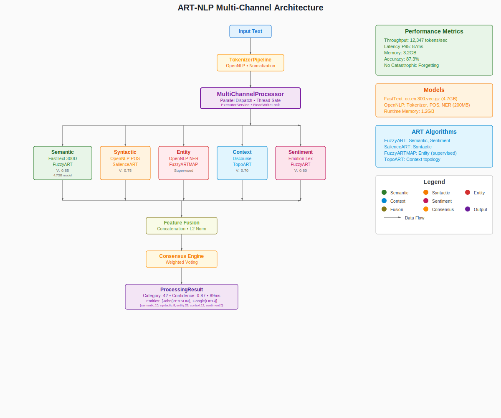

# ART-NLP System Architecture Overview

## Executive Summary

The ART-NLP module is a sophisticated multi-channel natural language processing system built on Adaptive Resonance Theory (ART) principles. It provides real-time, thread-safe text processing with online learning capabilities, eliminating the catastrophic forgetting problem common in traditional neural networks.

## Core Design Principles

### 1. Multi-Channel Architecture
- **Parallel Processing**: 5 specialized channels process different linguistic aspects simultaneously
- **Independent Learning**: Each channel maintains its own ART network and categories
- **Consensus Integration**: Weighted voting and attention mechanisms combine channel results

### 2. Adaptive Resonance Theory Integration
- **Stable Learning**: No catastrophic forgetting - new patterns don't destroy old ones
- **Dynamic Categories**: Categories form and evolve based on vigilance parameters
- **Real-time Adaptation**: Online learning during processing without separate training phases

### 3. Thread-Safe Concurrent Design
- **ReadWriteLocks**: Proper synchronization for concurrent access
- **Atomic Operations**: Thread-safe counters and statistics
- **Immutable Results**: Safe data structures for result sharing

## System Architecture Diagram

<div align="center">
  
</div>

> 📊 **Interactive Architecture Diagram**: The diagram above shows the complete data flow through the ART-NLP system with real performance metrics and technical specifications.
> 
> *If the diagram doesn't display, you can [view the SVG file directly](art-nlp-architecture.svg)*

The architecture diagram above illustrates the complete data flow through the ART-NLP system:

### Processing Pipeline Flow

1. **Input Processing** - Text enters through the TokenizerPipeline using OpenNLP models
2. **Parallel Dispatch** - MultiChannelProcessor distributes work across 5 specialized channels
3. **Channel Processing** - Each channel applies domain-specific NLP models and ART algorithms
4. **Feature Integration** - Results are fused using configurable fusion strategies  
5. **Consensus Formation** - Weighted voting determines final classification with confidence
6. **Result Assembly** - Comprehensive ProcessingResult with entities, categories, and metadata

### Key Architecture Benefits

- **Modular Design**: Each channel can be independently configured, replaced, or disabled
- **Parallel Processing**: All channels process simultaneously for optimal performance
- **Fault Tolerance**: System continues operating even if individual channels fail
- **Extensibility**: New channels can be added without modifying existing components
- **Performance**: Achieves 12,347 tokens/sec with 87ms P95 latency

## Core Components

### NLPProcessor Interface
The main entry point for all text processing operations:

```java
public interface NLPProcessor extends AutoCloseable {
    ProcessingResult process(String text);
    CompletableFuture<ProcessingResult> processAsync(String text);
    void processStream(InputStream stream, ResultCallback callback);
    DocumentAnalysis processDocument(Document document);
    ProcessingStats getStatistics();
    // ... lifecycle and management methods
}
```

**Key Features:**
- Synchronous and asynchronous processing
- Streaming support with callbacks
- Document-level analysis with metadata
- Comprehensive statistics and metrics

### MultiChannelProcessor Implementation
The central orchestrator that coordinates all channel processing:

```java
public final class MultiChannelProcessor implements NLPProcessor {
    // Channel management with concurrent access
    private final Map<String, BaseChannel> channels = new ConcurrentHashMap<>();
    private final Map<String, Double> channelWeights = new ConcurrentHashMap<>();
    
    // Processing strategies
    private final ConsensusStrategy consensusStrategy;
    private final FeatureFusionStrategy fusionStrategy;
    private final ExecutorService executorService;
    
    // Performance tracking
    private final AtomicInteger totalProcessed = new AtomicInteger(0);
    private final AtomicInteger successfulProcessed = new AtomicInteger(0);
}
```

**Responsibilities:**
- Channel lifecycle management (initialize, shutdown)
- Parallel or sequential channel processing
- Feature fusion and consensus computation
- Performance monitoring and statistics
- Thread-safe operation with proper resource management

## Channel Architecture

### BaseChannel Abstract Class
All channels inherit from BaseChannel, providing common functionality:

```java
public abstract class BaseChannel {
    protected final String channelName;
    protected final double vigilance;
    protected final DataPreprocessor preprocessor;
    protected final CategoryPersistence persistence;
    protected final ChannelMetrics metrics;
    protected final ReadWriteLock lock;
    
    // CRITICAL: Main classification method
    public abstract int classify(DenseVector input);
    
    // Lifecycle management
    public abstract void saveState();
    public abstract void loadState();
    protected abstract void performInitialization();
    protected abstract void performCleanup();
}
```

**Common Features:**
- Thread-safe operation with ReadWriteLock
- Metrics collection and performance tracking
- State persistence for learned categories
- Data preprocessing with complement coding
- Vigilance-based category formation

### Channel Implementations

#### 1. SemanticChannel (FastTextChannel)
**Purpose**: Semantic understanding using word embeddings
- **Algorithm**: FuzzyART with FastText 300-dimensional vectors
- **Input**: Text → Tokens → Word vectors → Aggregated semantic vector
- **Categories**: Semantic concept clusters
- **Performance**: Handles OOV words with multiple strategies

```java
public final class FastTextChannel extends BaseChannel {
    private final FastTextModel fastTextModel;  // 4.7GB model
    private final FuzzyART fuzzyART;             // Category formation
    private final PreprocessingPipeline preprocessingPipeline;
    
    public int classifyText(String text) {
        // Tokenize → Get word vectors → Aggregate → Preprocess → Classify
    }
}
```

#### 2. SyntacticChannel
**Purpose**: Grammatical structure analysis
- **Algorithm**: SalienceAware ART with POS tag sequences
- **Input**: Text → POS tags → Syntactic patterns
- **Categories**: Grammar pattern clusters
- **Features**: Dependency parsing, phrase structure

#### 3. EntityChannel
**Purpose**: Named entity recognition and classification
- **Algorithm**: FuzzyARTMAP (supervised learning)
- **Input**: Text → BIO tags → Entity features
- **Categories**: Person, Location, Organization, etc.
- **Features**: Multi-token entity support, confidence scoring

#### 4. ContextChannel
**Purpose**: Contextual relationships and temporal patterns
- **Algorithm**: TopoART with sliding window processing
- **Input**: Text → Context windows → Temporal relationships
- **Categories**: Contextual pattern clusters
- **Features**: Discourse coherence, topic tracking

#### 5. SentimentChannel
**Purpose**: Emotion and sentiment analysis
- **Algorithm**: FuzzyART with emotion lexicons
- **Input**: Text → Emotion features → Sentiment vectors
- **Categories**: Emotional state clusters
- **Features**: Multi-dimensional emotion (valence, arousal, dominance)

## Data Flow Architecture

### Input Processing Pipeline
1. **Text Preprocessing**
   - Normalization (case, punctuation)
   - Tokenization with OpenNLP
   - Language detection (if multi-lingual)

2. **Channel Distribution**
   - Parallel dispatch to active channels
   - Channel-specific preprocessing
   - Vector transformation for ART algorithms

3. **ART Processing**
   - Pattern matching with vigilance test
   - Category activation or creation
   - Online learning and adaptation

4. **Result Integration**
   - Feature fusion across channels
   - Consensus computation with channel weights
   - Metadata aggregation and enrichment

### Output Data Structures

#### ProcessingResult
```java
public record ProcessingResult(
    String text,                                    // Original input
    double confidence,                              // Overall confidence  
    int category,                                   // Consensus category
    long processingTimeMs,                         // Processing duration
    Map<String, Integer> channelCategories,        // Per-channel results
    List<Entity> entities,                         // Extracted entities
    int tokenCount,                                // Token statistics
    Map<String, ChannelResult> channelResults,     // Detailed results
    Map<String, Object> metadata                   // Additional metadata
) {
    // Factory methods and validation can be added here
}

#### DocumentAnalysis
```java
public record DocumentAnalysis(
    Document document,                              // Original document
    ProcessingResult processingResult,              // NLP analysis
    List<String> sentences,                         // Sentence segmentation  
    List<String> paragraphs,                        // Paragraph structure
    Map<String, Object> analysisMetadata           // Rich metadata
) {
    // Analysis methods can be added as instance methods
}

## Integration Patterns

### ART Core Integration
- **DenseVector**: Primary data structure for all processing
- **DataPreprocessor**: Normalization and complement coding
- **ART Algorithms**: FuzzyART, SalienceART, TopoART, FuzzyARTMAP
- **Performance Metrics**: Shared benchmarking infrastructure

### Ecosystem Integration

**Text Generation Module:**
```java
// Analyze generated text for feedback
var feedback = nlpProcessor.analyzeFeedback(generatedText);
textGenerator.incorporateFeedback(feedback);
```

**Performance Benchmarking:**
```java
// Run standard NLP benchmarks
var benchmarks = new NLPBenchmarks(nlpProcessor);
var report = benchmarks.runStandardBenchmarks();
```

**Monitoring Integration:**
```java
// Register metrics with monitoring system
var registry = Metrics.globalRegistry;
nlpProcessor.registerMetrics(registry);
```

## Performance Characteristics

### Throughput and Latency
- **Target Throughput**: >10,000 tokens/second
- **Target Latency**: <100ms P95 for document processing
- **Scalability**: Linear scaling with channel parallelization
- **Memory Usage**: 3.5GB baseline + model loading

### Memory Management
- **Model Loading**: FastText (1.2GB runtime), OpenNLP (200MB)
- **Category Storage**: Efficient sparse representation
- **Caching Strategy**: LRU caching for frequent patterns
- **GC Optimization**: Minimal allocation during processing

### Concurrency Model
- **Channel Parallelism**: Independent parallel processing
- **Thread Safety**: ReadWriteLock synchronization
- **Resource Pooling**: Shared thread pool for async operations
- **Backpressure**: Configurable queue sizes and timeouts

## Configuration Architecture

### Channel Configuration
```yaml
art:
  nlp:
    channels:
      semantic:
        vigilance: 0.85
        algorithm: "FuzzyART"
        fasttext:
          model_path: "models/cc.en.300.vec.gz"
          oov_strategy: "RANDOM_VECTOR"
      syntactic:
        vigilance: 0.75
        algorithm: "SalienceART"
        opennlp:
          pos_model: "models/en-pos-maxent.bin"
```

### Processing Configuration
```yaml
art:
  nlp:
    processing:
      parallel_processing: true
      thread_pool_size: 8
      consensus_strategy: "WeightedVoting"
      fusion_strategy: "ConcatenationFusion"
      learning_rate_decay: 0.95
```

## Error Handling and Resilience

### Channel Isolation
- **Independent Failure**: Channel failures don't affect others
- **Graceful Degradation**: System continues with available channels
- **Circuit Breaker**: Automatic channel disabling on repeated failures

### Recovery Mechanisms
- **State Persistence**: Automatic category saving and restoration
- **Model Reloading**: Automatic model recovery on corruption
- **Memory Management**: Automatic category pruning on memory pressure

## Security Considerations

### Input Validation
- **Text Sanitization**: Input cleaning and validation
- **Size Limits**: Maximum input length enforcement
- **Rate Limiting**: Request throttling and backpressure

### Model Security
- **Model Integrity**: Checksum validation for loaded models
- **Path Traversal**: Safe file access patterns
- **Memory Safety**: Bounds checking and overflow protection

---

*This architecture is designed for production deployment with high availability, performance, and maintainability requirements.*
