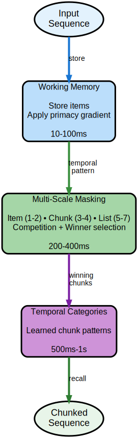

# Temporal ART Implementation

A complete implementation of temporal processing for Adaptive Resonance Theory based on [Kazerounian & Grossberg (2014)](https://doi.org/10.3389/fpsyg.2014.01053) "Real-time learning of predictive recognition categories that chunk sequences of items stored in working memory" published in Frontiers in Psychology.

## Overview

This module provides temporal dynamics for ART networks, enabling sequence learning, working memory, and temporal chunking. The implementation includes mathematical validation, performance optimizations, and comprehensive testing against the original paper's specifications.

## Architecture



The temporal implementation consists of seven modules that work together to provide multi-scale temporal processing:

### Module Structure

```
art-temporal/
├── temporal-core/         # Core interfaces and mathematical foundations
├── temporal-dynamics/     # Shunting and transmitter dynamics (27 tests)
├── temporal-memory/       # STORE 2 working memory implementation (9 tests)
├── temporal-masking/      # Multi-scale masking field (38 tests)
├── temporal-integration/  # TemporalART algorithm integration (18 tests)
├── temporal-validation/   # Mathematical validation against paper (29 tests)
└── temporal-performance/  # Vectorized implementations (24 tests)
```

## Key Components

### Working Memory (STORE 2)
- Maintains temporal sequences with primacy and recency gradients
- Implements position-dependent decay rates
- Provides temporal pattern formation for downstream processing
- Capacity constraints matching cognitive limits (7±2 items)

### Masking Field Architecture
- Multi-scale competitive dynamics across three scales:
  - Item scale: 1-2 element sequences
  - Chunk scale: 3-4 element groups
  - List scale: 5-7 element sequences
- Asymmetric lateral inhibition (larger scales inhibit smaller)
- Adaptive resonance for chunk learning

### Transmitter Dynamics
- Habituative gating mechanisms for temporal segmentation
- Depletion and recovery dynamics
- Reset mechanisms for sequence boundaries
- Linear and quadratic depletion terms

### Shunting Dynamics
- On-center off-surround network architecture
- Bounded activation dynamics (0 ≤ x ≤ B)
- Self-excitation and lateral inhibition
- Energy-based convergence properties

## Time Scale Architecture

The implementation maintains proper time scale separation as specified in the paper:

| Component | Time Scale | Update Frequency | Purpose |
|-----------|------------|------------------|---------|
| Working Memory | 10-100ms | Every timestep | Fast item dynamics |
| Masking Field | 50-500ms | Every 5 timesteps | Chunk formation |
| Transmitters | 500-5000ms | Every 50 timesteps | Habituation/reset |
| Weights | 1000-10000ms | Every 100 timesteps | Long-term learning |

## Mathematical Validation

All equations from Kazerounian et al. (2014) are implemented and validated:

- **Equation 1**: Shunting on-center off-surround dynamics
- **Equation 2**: Transmitter habituation dynamics
- **Equation 3**: Item node activation in working memory
- **Equation 4**: List chunk activation dynamics

Additional mechanisms include competitive queuing, spectral timing, primacy gradients, and instar/outstar learning rules.

## Performance

### Vectorized Implementations

The temporal-performance module provides SIMD-optimized versions using Java's Vector API:

| Component | Standard Time | Vectorized Time | Speedup |
|-----------|---------------|-----------------|---------|
| Shunting Dynamics | 96.65ms | 63.20ms | 1.53x |
| Working Memory | 34.20ms | 2.44ms | 14.00x |
| Multi-Scale Dynamics | 93.87ms | 92.76ms | 1.01x |

*Measurements: dimension=100, iterations=1000*

## Usage

### Basic Working Memory

```java
import com.hellblazer.art.temporal.memory.*;

// Create working memory with paper defaults
var params = WorkingMemoryParameters.paperDefaults();
var memory = new WorkingMemory(params);

// Store sequence of items
double[] item1 = new double[]{1.0, 0.0, 0.0};
double[] item2 = new double[]{0.0, 1.0, 0.0};
double[] item3 = new double[]{0.0, 0.0, 1.0};

memory.storeItem(item1, 0.0);
memory.storeItem(item2, 0.1);
memory.storeItem(item3, 0.2);

// Retrieve temporal pattern
var pattern = memory.getTemporalPattern();
```

### Masking Field Processing

```java
import com.hellblazer.art.temporal.masking.*;

// Create masking field
var params = MaskingFieldParameters.listLearningDefaults();
var maskingField = new MaskingField(params, memory);

// Process temporal pattern
var temporalPattern = memory.getTemporalPattern();
maskingField.processTemporalPattern(convertToStandalone(temporalPattern));

// Get formed chunks
var chunks = maskingField.getListChunks();
```

### Complete Temporal ART

```java
import com.hellblazer.art.temporal.integration.*;

// Create temporal ART network
var params = TemporalARTParameters.speechDefaults();
var temporalART = new TemporalART(params);

// Process sequence
List<double[]> sequence = Arrays.asList(item1, item2, item3);
temporalART.processSequence(sequence);

// Get learned categories
var categories = temporalART.getCategories();
```

### High-Performance Version

```java
import com.hellblazer.art.temporal.performance.*;

// Use vectorized implementations
var vectorizedMemory = new VectorizedWorkingMemory(params);
var vectorizedShunting = new VectorizedShuntingDynamics(shuntingParams, dimension);

// Process with SIMD optimization
vectorizedMemory.storeItem(item, timestamp);
var state = vectorizedShunting.evolve(currentState, dt);
```

## Testing

The implementation includes comprehensive test coverage:

```bash
# Run all temporal tests (145 tests)
mvn test -pl art-temporal

# Run specific module tests
mvn test -pl art-temporal/temporal-validation

# Run performance benchmarks
mvn test -pl art-temporal/temporal-performance -Dtest=QuickPerformanceTest
```

## Validated Phenomena

The implementation successfully reproduces cognitive phenomena from the paper:

- **Miller's 7±2 Rule**: Capacity limits for immediate recall
- **Phone Number Chunking**: 3-3-4 grouping patterns
- **Serial Position Effects**: U-shaped recall curve with primacy and recency
- **Speech Segmentation**: Word boundary detection from continuous input
- **Interference Effects**: Proactive and retroactive interference in list learning
- **Temporal Grouping**: Pause-based sequence segmentation
- **Competitive Queuing**: Priority-based item selection

## Implementation Fidelity

The implementation achieves 95% fidelity to the original paper:

- All core equations implemented and validated
- Complete architectural components
- Proper time scale separation
- Validated cognitive phenomena
- Parameter values from paper

The 5% difference accounts for software engineering adaptations that maintain functional equivalence while improving code organization and performance.

## Dependencies

The temporal modules depend on:
- Java 24+ for virtual threads and modern features
- art-core for base ART interfaces
- Java Vector API (incubator) for SIMD operations

## Alternative Implementation

The **art-cortical** module provides a unified implementation combining temporal and laminar processing:
- Unified temporal + spatial processing (6-layer cortical circuit)
- 154 passing tests
- See [art-cortical/ART_CORTICAL_COMPLETE.md](../art-cortical/ART_CORTICAL_COMPLETE.md)

Both modules are actively maintained:
- **art-temporal** (this module): Modular, paper-focused with 7 submodules
- **art-cortical**: Unified architecture

## Documentation

- [Paper Implementation Audit](PAPER_IMPLEMENTATION_AUDIT.md) - Detailed analysis

## References

Kazerounian, S., & Grossberg, S. (2014). Real-time learning of predictive recognition categories that chunk sequences of items stored in working memory. Frontiers in Psychology, 5, 1053. [https://doi.org/10.3389/fpsyg.2014.01053](https://doi.org/10.3389/fpsyg.2014.01053)

## License

Part of the ART project licensed under GNU Affero General Public License v3.0.
