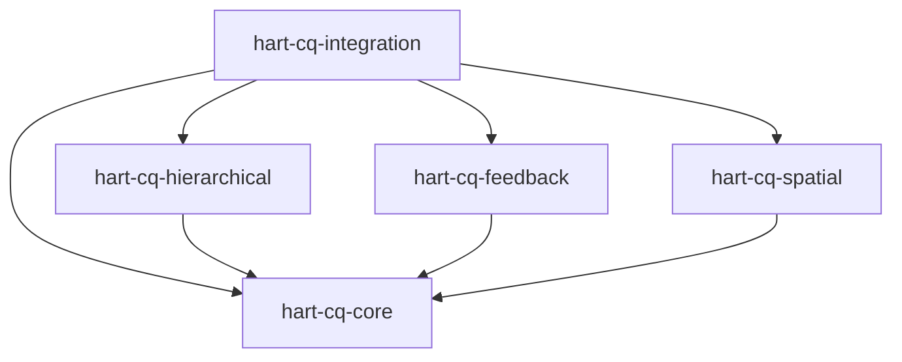

# HART-CQ Architecture Deep Dive

## Table of Contents

1. [System Overview](#system-overview)
2. [Core Principles](#core-principles)
3. [Component Architecture](#component-architecture)
4. [Data Flow](#data-flow)
5. [Channel Architecture](#channel-architecture)
6. [Hierarchical Processing](#hierarchical-processing)
7. [Template System](#template-system)
8. [Competitive Dynamics](#competitive-dynamics)
9. [Performance Architecture](#performance-architecture)
10. [Security & Safety](#security--safety)

## System Overview

HART-CQ (Hierarchical Adaptive Resonance Theory with Competitive Queuing) is a deterministic text processing system that uses architectural constraints and template-based generation for reliable output.

### Key Innovation

HART-CQ combines several architectural approaches:
1. Uses ART for comprehension and pattern recognition
2. Generates output through template selection
3. Employs competitive dynamics for decision making
4. Processes through 6 parallel channels

### Architecture Diagram

```
┌─────────────────────────────────────────────────────────────┐
│                        Input Text                           │
└─────────────────────────────┬───────────────────────────────┘
                              ↓
┌─────────────────────────────────────────────────────────────┐
│                         Tokenizer                           │
│  • Edge case handling                                       │
│  • Type classification                                       │
│  • Timestamp tracking                                       │
└─────────────────────────────┬───────────────────────────────┘
                              ↓
┌─────────────────────────────────────────────────────────────┐
│                 Sliding Window (20 tokens)                  │
│  • 5-token overlap                                          │
│  • Boundary detection                                       │
└─────────────────────────────┬───────────────────────────────┘
                              ↓
┌─────────────────────────────────────────────────────────────┐
│            Multi-Channel Processor (6 channels)             │
│  ┌──────────┐ ┌──────────┐ ┌──────────┐ ┌──────────┐        │
│  │Positional│ │   Word   │ │ Context  │ │Structural│ ...    │
│  └──────────┘ └──────────┘ └──────────┘ └──────────┘        │
└─────────────────────────────┬───────────────────────────────┘
                              ↓
┌─────────────────────────────────────────────────────────────┐
│           Hierarchical Processor (3 levels)                 │
│  • Level 1: Morpheme (ρ=0.9)                                │
│  • Level 2: Phrase (ρ=0.7)                                  │
│  • Level 3: Discourse (ρ=0.5)                               │
└─────────────────────────────┬───────────────────────────────┘
                              ↓
┌─────────────────────────────────────────────────────────────┐
│            Competitive Queue (Grossberg)                    │
│  • Self-excitation: 1.2                                     │
│  • Lateral inhibition: 0.3                                  │
│  • Winner-take-all selection                                │
└─────────────────────────────┬───────────────────────────────┘
                              ↓
┌─────────────────────────────────────────────────────────────┐
│                    Template Selection                       │
│  • 25+ predefined templates                                 │
│  • Slot-based filling                                       │
│  • Deterministic output                                     │
└─────────────────────────────┬───────────────────────────────┘
                              ↓
┌─────────────────────────────────────────────────────────────┐
│                        Output Text                          │
└─────────────────────────────────────────────────────────────┘
```

## Core Principles

### 1. Deterministic Output

**Problem**: Need for consistent, predictable text generation.

**HART-CQ Solution**:
- Template-based output generation
- Word2Vec for semantic comprehension
- Deterministic selection process
- Structured slot filling

### 2. Stability-Plasticity Balance

**Problem**: Learning new patterns while preserving existing knowledge.

**HART-CQ Solution**:
- ART's vigilance parameter controls match threshold
- Online learning without catastrophic forgetting
- Hierarchical levels with different vigilance values

### 3. Parallel Feature Extraction

**Problem**: Sequential processing misses multi-scale patterns.

**HART-CQ Solution**:
- 6 channels process different features simultaneously
- Convergent with Transformer multi-head attention
- Each channel specialized for specific patterns

### 4. Competitive Selection

**Problem**: Choosing best response from multiple candidates.

**HART-CQ Solution**:
- Grossberg dynamics implement competition
- Self-excitation strengthens candidates
- Lateral inhibition suppresses alternatives
- Winner-take-all or k-winners selection

## Component Architecture

### Core Components

```java
// Main integration point
public class HARTCQ {
    private final Tokenizer tokenizer;
    private final StreamProcessor streamProcessor;
    private final MultiChannelProcessor channelProcessor;
    private final HierarchicalProcessor hierarchicalProcessor;
    private final CompetitiveQueue competitiveQueue;
    private final TemplateLibrary templateLibrary;
    private final FeedbackController feedbackController;
}
```

### Module Dependencies



## Data Flow

### 1. Input Processing

```java
// Tokenization with edge case handling
Token[] tokens = tokenizer.tokenize(input);

// Features:
// - Handles empty strings
// - Manages special characters
// - Preserves timestamps
// - Type classification (WORD, PUNCTUATION, NUMBER, etc.)
```

### 2. Window Generation

```java
// Sliding window with overlap
SlidingWindow window = new SlidingWindow(20, 5);
List<Token[]> windows = window.generate(tokens);

// Boundary detection for:
// - Sentence boundaries
// - Semantic shifts
// - Structural changes
```

### 3. Channel Processing

```java
// Parallel channel execution
float[] features = channelProcessor.processWindow(window);

// Each channel contributes:
// - PositionalChannel: 64 dimensions
// - WordChannel: 128 dimensions
// - ContextChannel: 40 dimensions
// - StructuralChannel: 56 dimensions
// - SemanticChannel: 48 dimensions
// - TemporalChannel: 32 dimensions
// Total: 368 dimensions
```

### 4. Hierarchical Categorization

```java
// Three-level processing
String[] categories = hierarchicalProcessor.process(features);

// Level 1: Fine-grained morpheme patterns
// Level 2: Phrase-level structures
// Level 3: Discourse-level coherence
```

### 5. Template Selection

```java
// Competitive dynamics
Template selected = competitiveQueue.select(categories);

// Grossberg dynamics ensure:
// - Strongest activation wins
// - Similar templates compete
// - Primacy gradient favors earlier items
```

### 6. Output Generation

```java
// Deterministic slot filling
String output = selected.fill(extractedValues);

// No generation, only:
// - Slot identification
// - Value extraction
// - Template instantiation
```

## Channel Architecture

### Channel Interface

```java
public interface Channel {
    float[] processWindow(Token[] tokens);
    int getOutputDimension();
    String getName();
    void reset();
    boolean isDeterministic();
    ChannelType getChannelType();
}
```

### Channel Implementations

#### 1. PositionalChannel
- **Purpose**: Encode token positions
- **Method**: Sinusoidal encoding (like Transformers)
- **Dimension**: 64
- **Formula**: `PE(pos,2i) = sin(pos/10000^(2i/d))`

#### 2. WordChannel
- **Purpose**: Word-level semantics
- **Method**: Word2Vec embeddings
- **Dimension**: 128
- **Constraint**: COMPREHENSION_ONLY flag

#### 3. ContextChannel
- **Purpose**: Historical context
- **Method**: Sliding history with momentum
- **Dimension**: 40
- **Features**: Decay, momentum, history window

#### 4. StructuralChannel
- **Purpose**: Grammatical patterns
- **Method**: Rule-based feature extraction
- **Dimension**: 56
- **Features**: POS patterns, dependency structures

#### 5. SemanticChannel
- **Purpose**: Meaning relationships
- **Method**: Semantic similarity metrics
- **Dimension**: 48
- **Features**: Topic coherence, entity tracking

#### 6. TemporalChannel
- **Purpose**: Time-based patterns
- **Method**: Temporal decay functions
- **Dimension**: 32
- **Features**: Recency, duration, intervals

Note: SyntaxChannel and PhoneticChannel are implemented but not currently active in the pipeline to optimize performance.

## Hierarchical Processing

### DeepARTMAP Integration

```java
public class HierarchicalProcessor {
    private final DeepARTMAP deepART;
    private final double[] vigilanceLevels = {0.9, 0.7, 0.5};

    public String[] process(float[] features) {
        // Level 1: High vigilance for precise matching
        String morpheme = deepART.categorize(features, vigilanceLevels[0]);

        // Level 2: Medium vigilance for phrase patterns
        String phrase = deepART.categorize(features, vigilanceLevels[1]);

        // Level 3: Low vigilance for discourse coherence
        String discourse = deepART.categorize(features, vigilanceLevels[2]);

        return new String[]{morpheme, phrase, discourse};
    }
}
```

### Vigilance Parameter Effects

| Level | Vigilance | Purpose | Effect |
|-------|-----------|---------|--------|
| 1 | 0.9 | Morpheme | Precise pattern matching |
| 2 | 0.7 | Phrase | Structural grouping |
| 3 | 0.5 | Discourse | Thematic coherence |

## Template System

### Template Structure

```java
public class Template {
    private final String id;
    private final String pattern;
    private final List<Slot> slots;
    private final TemplateType type;

    public String fill(Map<String, String> values) {
        String result = pattern;
        for (Slot slot : slots) {
            String value = values.get(slot.getName());
            if (value != null) {
                result = result.replace(slot.getPlaceholder(), value);
            }
        }
        return result;
    }
}
```

### Template Examples

```java
// Question template
Template question = new Template(
    "question.what",
    "The [ANSWER] of [SUBJECT] is [VALUE].",
    List.of(new Slot("ANSWER"), new Slot("SUBJECT"), new Slot("VALUE")),
    TemplateType.QUESTION
);

// Statement template
Template statement = new Template(
    "statement.action",
    "[SUBJECT] [VERB] [OBJECT] [MODIFIER].",
    List.of(new Slot("SUBJECT"), new Slot("VERB"),
            new Slot("OBJECT"), new Slot("MODIFIER")),
    TemplateType.STATEMENT
);
```

## Competitive Dynamics

### Grossberg Equations

```java
public class CompetitiveQueue {
    // Activation dynamics
    // dx_i/dt = -A*x_i + (B - x_i)*f(x_i) - x_i*Σf(x_j)

    private static final double A = 0.1;  // Decay
    private static final double B = 1.0;  // Upper bound
    private static final double SELF_EXCITATION = 1.2;
    private static final double LATERAL_INHIBITION = 0.3;

    public double updateActivation(double current, double[] others) {
        double self = SELF_EXCITATION * sigmoid(current);
        double competition = 0;

        for (double other : others) {
            competition += LATERAL_INHIBITION * sigmoid(other);
        }

        return -A * current + (B - current) * self - current * competition;
    }
}
```

### Selection Mechanism

1. **Initialize**: All templates start with base activation
2. **Compete**: Templates interact through dynamics
3. **Converge**: System reaches stable state
4. **Select**: Highest activation wins

## Performance Architecture

### Parallelization Strategy

```java
// Channel parallelization
ExecutorService executor = ForkJoinPool.commonPool();
List<Future<float[]>> futures = new ArrayList<>();

for (Channel channel : channels) {
    futures.add(executor.submit(() -> channel.processWindow(window)));
}

// Collect results
float[] combined = combineResults(futures);
```

### Optimization Techniques

1. **Batch Processing**: Process multiple sentences together
2. **Channel Caching**: Cache frequently used embeddings
3. **Template Precompilation**: Precompute template structures
4. **Lock-Free Structures**: Use ConcurrentLinkedDeque for history
5. **SIMD Operations**: Vectorized array operations

### Memory Management

```java
// Efficient memory usage
public class MemoryOptimizedProcessor {
    // Object pooling for windows
    private final ObjectPool<Token[]> windowPool;

    // Circular buffer for history
    private final CircularBuffer<float[]> historyBuffer;

    // Weak references for cache
    private final WeakHashMap<String, float[]> cache;
}
```

## Security & Safety

### Input Validation

```java
public class InputValidator {
    public ValidationResult validate(String input) {
        // Check length limits
        if (input.length() > MAX_INPUT_LENGTH) {
            return ValidationResult.error("Input too long");
        }

        // Check for injection attempts
        if (containsSQLInjection(input)) {
            return ValidationResult.error("Invalid characters");
        }

        // Check encoding
        if (!isValidUTF8(input)) {
            return ValidationResult.error("Invalid encoding");
        }

        return ValidationResult.success();
    }
}
```

### Output Safety

```java
public class OutputSanitizer {
    public String sanitize(String output) {
        // Remove any unexpected patterns
        output = removeScriptTags(output);

        // Ensure template boundaries
        output = enforceTemplateBounds(output);

        // Validate against whitelist
        output = validateAgainstWhitelist(output);

        return output;
    }
}
```

### Thread Safety

```java
// Thread-safe channel implementation
public class ThreadSafeChannel implements Channel {
    private final ThreadLocal<float[]> threadLocalBuffer;
    private final ConcurrentLinkedDeque<float[]> history;
    private final AtomicLong processCount;

    @Override
    public synchronized float[] processWindow(Token[] tokens) {
        // Thread-safe processing
    }
}
```

## Convergence with Transformers

### Discovered Parallels

| HART-CQ Component | Transformer Equivalent |
|-------------------|----------------------|
| Multi-Channel | Multi-Head Attention |
| Resonance | Attention Mechanism |
| Categories | Value Vectors |
| Vigilance | Attention Threshold |
| Positional Channel | Positional Encoding |

### Key Differences

| Aspect | HART-CQ | Transformers |
|--------|---------|--------------|
| Learning | Online, incremental | Batch, gradient-based |
| Output | Deterministic templates | Probabilistic generation |
| Explainability | Category activation | Attention weights |
| Memory | Stable categories | Gradient updates |
| Output Control | Template-bounded | Probabilistic |

## Future Enhancements

### Planned Improvements

1. **GPU Acceleration**: OpenCL kernels for channel processing
2. **Distributed Processing**: Multi-node scaling
3. **Dynamic Templates**: Learn templates from examples
4. **Additional Languages**: Multilingual support
5. **Real-time Streaming**: Kafka/WebSocket integration

### Research Directions

1. **Attention in ART**: Add attention within hierarchical levels
2. **Learned Channels**: Train channel features
3. **Meta-Learning**: Learn vigilance parameters
4. **Quantum ART**: Quantum resonance exploration

---

**Document Version**: 1.0
**Last Updated**: September 14, 2025
**Author**: Hal Hildebrand
